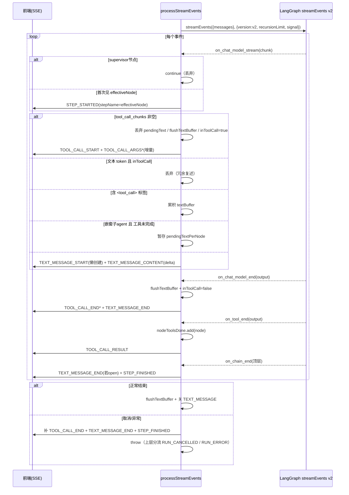

# `processStreamEvents` 逻辑链路解读

> 文件：`src/agent/agent.service.ts`（约 126–384 行）
> 方法：`private async processStreamEvents(...)`
> 职责：把 LangGraph `graph.streamEvents({ version: 'v2' })` 的底层事件流，翻译成前端可消费的 AG-UI 事件流（`STEP_*` / `TEXT_MESSAGE_*` / `TOOL_CALL_*`），并处理取消、中断收尾、XML 工具调用、子 Agent 思考文本过滤等脏活。

## 1. 函数签名与调用上下游

### 1.1 签名

```typescript
private async processStreamEvents(
  graph: any,
  messages: Array<{ role: string; content: string }>,
  onEvent: (e: AGUIEvent) => void,
  recursionLimit: number,
  signal?: AbortSignal,
)
```

| 参数 | 含义 |
|---|---|
| `graph` | 已编译好的 LangGraph（Supervisor 图或 DAG 图），必须实现 `streamEvents()` |
| `messages` | 上层透传的聊天历史，`{ role, content }[]` |
| `onEvent` | AG-UI 事件发射器，最终被 `ChatService` 转成 SSE 发给前端 |
| `recursionLimit` | LangGraph 最大递归步数，Supervisor 模式传 `25`，DAG 模式传 `50` |
| `signal` | 可选的 `AbortSignal`，用于传输中断 / `DELETE /runs/:runId` 取消 |

### 1.2 谁调用它

```typescript
// Supervisor 模式（recursionLimit = 25）
const graph = this.supervisorFactory.createSupervisorGraph(llm, agentDefs);
await this.processStreamEvents(graph, request.messages, onEvent, 25, request.signal);

// DAG 模式（recursionLimit = 50）
const ctx: DagExecutionContext = { llm, tools: toolsMap, onEvent, threadId: request.threadId, signal: request.signal };
const graph = this.dagEngine.compile(workflow.nodes, workflow.edges, ctx);
await this.processStreamEvents(graph, request.messages, onEvent, 50, request.signal);
```

上游 `execute()` 负责 `RUN_STARTED / RUN_FINISHED / RUN_ERROR` 生命周期，本函数只负责中间的 `STEP / TEXT / TOOL` 事件：

```typescript
async execute(request: OrchestrationRequest): Promise<void> {
  const { threadId, runId, onEvent } = request;
  // RunStarted
  onEvent({ type: EventType.RUN_STARTED, threadId, runId });
  try {
    request.signal?.throwIfAborted();
    if (request.workflowId) {
      await this.executeDag(request);
    } else {
      await this.executeSupervisor(request);
    }
    request.signal?.throwIfAborted();
    // RunFinished
    onEvent({ type: EventType.RUN_FINISHED, threadId, runId });
  } catch (error: any) {
    // 取消直接上抛，由 Controller 统一发 RUN_CANCELLED；真异常才在这里发 RUN_ERROR
    if (request.signal?.aborted || error?.name === 'AbortError') throw error;
    this.logger.error(`Agent execution error: ${error.message}`, error.stack);
    onEvent({ type: EventType.RUN_ERROR, message: error.message });
  }
}
```

### 1.3 事件流启动

```typescript
const eventStream = graph.streamEvents(
  { messages: this.toLangChainMessages(messages) },
  { version: 'v2', recursionLimit, ...(signal ? { signal } : {}) },
);
```

其中消息格式先被归一化：

```typescript
private toLangChainMessages(messages: Array<{ role: string; content: string }>): BaseMessage[] {
  return messages.map((m) => {
    if (m.role === 'system') return new SystemMessage(m.content);
    if (m.role === 'assistant') return new AIMessage(m.content);
    return new HumanMessage(m.content);
  });
}
```

关键点：`version: 'v2'` 才会产生 `on_chat_model_stream / on_chat_model_end / on_tool_end / on_chain_end` 这四类本函数依赖的事件名；`signal` 直接透传给 LangGraph，底层 LLM / Tool 调用可被中断。

---

## 2. 全部状态变量一览（防重入 / 去重 / 缓冲）

```typescript
// 跟踪当前正在流式输出的文本消息
let currentMessageId: string | null = null;
// 跟踪已发射过的 step
const activeSteps = new Set<string>();
// 跟踪已处理过的工具调用
const emittedToolCalls = new Set<string>();
// 跟踪已结束的工具调用（用于取消时补发 TOOL_CALL_END）
const emittedToolEnds = new Set<string>();
// 跟踪已看到的 tool 消息
const emittedToolResults = new Set<string>();
// 标记当前是否正处于工具调用阶段（跳过工具调用期间的文本输出）
let inToolCall = false;
// 累积文本缓冲区，用于检测和过滤 XML 工具调用标签
let textBuffer = '';
// 跟踪每个节点是否已执行过工具调用（用于过滤子 agent 工具调用前的“思考”文本）
const nodeHasToolCall = new Set<string>();
// 跟踪每个节点的工具调用是否已完成（收到 on_tool_end）
const nodeToolsDone = new Set<string>();
// 暂存子 agent 工具调用前的“思考”文本
const pendingTextPerNode = new Map<string, string>();
```

| 变量 | 类型 | 作用 |
|---|---|---|
| `currentMessageId` | `string \| null` | 当前未闭合的 `TEXT_MESSAGE_START` 的 ID，一次只允许一个文本消息处于 open 状态 |
| `activeSteps` | `Set<string>` | 已发 `STEP_STARTED` 但未发 `STEP_FINISHED` 的节点名，用于补 `STEP_FINISHED` 和去重 |
| `emittedToolCalls` | `Set<string>` | 已发 `TOOL_CALL_START` 的 `toolCallId`，`tool_call_chunks` 是增量分片，同一 ID 会出现多次，必须去重 |
| `emittedToolEnds` | `Set<string>` | 已发 `TOOL_CALL_END` 的 ID，用于取消收尾时补发，避免前端转圈 |
| `emittedToolResults` | `Set<string>` | 已发 `TOOL_CALL_RESULT` 的 ID，避免 `on_tool_end` 重复发射 |
| `inToolCall` | `boolean` | 结构化工具调用进行中标志，为 `true` 时丢弃同期混杂的文本 token（通常是冗余复述） |
| `textBuffer` | `string` | XML `<tool_call>` 标签的累积缓冲区，跨 token 边界拼接后再清洗 |
| `nodeHasToolCall` | `Set<string>` | 记下哪些节点出现过工具调用（含 XML 格式），语义标记 |
| `nodeToolsDone` | `Set<string>` | 收到 `on_tool_end` 后标记，之后该节点的 LLM 文本才允许直发（见 §5.4） |
| `pendingTextPerNode` | `Map<string, string>` | 嵌套子 Agent 在工具完成前的“思考”文本暂存区，工具调用开始时直接丢弃，工具完成后才放行后续文本 |

正则与辅助函数：

```typescript
// 检测文本中是否包含 XML 格式的工具调用标签（某些模型如 qwen 会这样输出）
const TOOL_CALL_XML_RE = /<\/?tool_call>|<tool_call\b/;
const TOOL_CALL_BLOCK_RE = /<tool_call[\s\S]*?<\/tool_call>/g;

// 提取 chunk.content 中的纯文本
const extractText = (content: any): string => {
  if (typeof content === 'string') return content;
  if (Array.isArray(content)) {
    return content
      .filter((c: any) => c.type === 'text')
      .map((c: any) => c.text || '')
      .join('');
  }
  return '';
};

// 将缓冲区中清洗过的文本发射出去
const flushTextBuffer = () => {
  if (!textBuffer) return;
  // 移除完整的 <tool_call>...</tool_call> 块
  let cleaned = textBuffer.replace(TOOL_CALL_BLOCK_RE, '');
  // 移除残留的开/闭标签及其属性
  cleaned = cleaned.replace(/<\/?tool_call[^>]*>/g, '').trim();
  if (cleaned) {
    if (!currentMessageId) {
      currentMessageId = genId();
      onEvent({ type: EventType.TEXT_MESSAGE_START, messageId: currentMessageId, role: 'assistant' });
    }
    onEvent({ type: EventType.TEXT_MESSAGE_CONTENT, messageId: currentMessageId, delta: cleaned });
  }
  textBuffer = '';
};
```

`flushTextBuffer` 是唯一的缓冲区出口：先删完整 `<tool_call>...</tool_call>` 块，再删残留标签，最后 `trim()`；为空则直接丢弃，非空则确保 `TEXT_MESSAGE_START` 已开再发 `TEXT_MESSAGE_CONTENT`。

---

## 3. 主循环骨架与节点名归一化

```typescript
try {
  for await (const event of eventStream) {
    // 取消检查：signal 已 abort 时尽快退出，让上层走 RUN_CANCELLED
    signal?.throwIfAborted();
    const { event: eventName, data, metadata } = event;

    // 从 metadata 中提取当前节点名
    // 对于嵌套子图（如 createReactAgent），checkpoint_ns 格式为 "researcher:xxx"
    const langgraphNode = metadata?.langgraph_node || '';
    const checkpointNs: string = metadata?.langgraph_checkpoint_ns || '';
    // 提取顶层父节点名（用于 step 追踪）
    const parentNode = checkpointNs ? checkpointNs.split(':')[0] : '';
    const effectiveNode = parentNode || langgraphNode;
    // ... 四大事件分支（见 §4–§7）
  }

  // 确保最后的缓冲区和文本消息已关闭
  flushTextBuffer();
  if (currentMessageId) {
    onEvent({ type: EventType.TEXT_MESSAGE_END, messageId: currentMessageId });
    currentMessageId = null;
  }
}
```

节点名三元组：

```typescript
const langgraphNode = metadata?.langgraph_node || '';
const checkpointNs: string = metadata?.langgraph_checkpoint_ns || '';
const parentNode = checkpointNs ? checkpointNs.split(':')[0] : '';
const effectiveNode = parentNode || langgraphNode;
```

- 顶层节点（如 `researcher`）：`langgraph_node='researcher'`，`checkpoint_ns=''` → `effectiveNode='researcher'`。
- 嵌套子图内部（如 `researcher` 内部的 `agent`）：`checkpoint_ns='researcher:xxx'` → `parentNode='researcher'`，`effectiveNode='researcher'`。这样子图内部所有 token 都被折叠到顶层 step，避免前端出现 `agent / tools` 这类内部节点名。
- `supervisor` 路由节点的文本会被整体跳过（见 §4.1）。

每次迭代第一件事就是 `signal?.throwIfAborted()`，保证取消后不再处理后续事件，直接跳到 `catch` 做收尾。

---

## 4. 分支一：`on_chat_model_stream` —— token 级流式（最复杂）

```typescript
// ── LLM token 级别流式 ──
if (eventName === 'on_chat_model_stream' && data.chunk) {
  const chunk = data.chunk;

  // 跳过 supervisor 路由节点的流式输出
  if (langgraphNode === 'supervisor' || effectiveNode === 'supervisor') continue;

  // 确保 step 已开始（使用 effectiveNode 作为 step 名）
  if (effectiveNode && !activeSteps.has(effectiveNode)) {
    activeSteps.add(effectiveNode);
    onEvent({ type: EventType.STEP_STARTED, stepName: effectiveNode });
  }
  // ... 4.2–4.5
}
```

### 4.1 跳过 supervisor + 懒创建 step

```typescript
// 跳过 supervisor 路由节点的流式输出
if (langgraphNode === 'supervisor' || effectiveNode === 'supervisor') continue;

// 确保 step 已开始（使用 effectiveNode 作为 step 名）
if (effectiveNode && !activeSteps.has(effectiveNode)) {
  activeSteps.add(effectiveNode);
  onEvent({ type: EventType.STEP_STARTED, stepName: effectiveNode });
}
```

supervisor 只做路由决策（输出下一个 agent 名），它的 token 对用户无意义，必须丢弃；`STEP_STARTED` 是懒创建的——第一个属于该节点的 token 到达时才发射。

### 4.2 结构化工具调用（OpenAI / Anthropic 标准路径）

```typescript
// 结构化工具调用 chunk（OpenAI 等标准模型）
if (chunk.tool_call_chunks?.length > 0) {
  // 工具调用开始 → 丢弃子 agent 之前暂存的“思考”文本
  if (effectiveNode && parentNode && langgraphNode !== parentNode) {
    pendingTextPerNode.delete(effectiveNode);
  }
  flushTextBuffer();
  inToolCall = true;
  if (effectiveNode) nodeHasToolCall.add(effectiveNode);

  for (const tc of chunk.tool_call_chunks) {
    const toolCallId = tc.id || '';
    if (toolCallId && !emittedToolCalls.has(toolCallId)) {
      emittedToolCalls.add(toolCallId);
      onEvent({
        type: EventType.TOOL_CALL_START,
        toolCallId,
        toolCallName: tc.name || '',
        parentMessageId: genId(),
      });
    }
    if (toolCallId && tc.args) {
      onEvent({ type: EventType.TOOL_CALL_ARGS, toolCallId, delta: tc.args });
    }
  }
  continue;
}
```

链路：`tool_call_chunks` 到达 → 丢弃该节点暂存的思考文本 → `flushTextBuffer()` 把缓冲区残留刷掉 → 置 `inToolCall=true` → 首见 `toolCallId` 发 `TOOL_CALL_START`，每个分片的 `tc.args` 发 `TOOL_CALL_ARGS`（增量 JSON 片段，前端自行拼接）。注意 `TOOL_CALL_END` 不在这里发，要等 `on_chat_model_end`（见 §5）。

### 4.3 纯文本 token 提取 + 工具调用期间屏蔽

```typescript
// 文本内容 token
const textContent = extractText(chunk.content);
if (!textContent) continue;

// 如果正在结构化工具调用阶段，跳过同步输出的文本（通常是冗余的）
if (inToolCall) continue;
```

`extractText` 兼容 `string` 和 `ContentBlock[]` 两种形态；`inToolCall=true` 期间的文本一般是模型对工具参数的复述，直接丢弃。

### 4.4 XML 工具调用标签（qwen 等开源模型路径）

```typescript
// 检查是否包含 XML 工具调用标签
if (TOOL_CALL_XML_RE.test(textContent) || TOOL_CALL_XML_RE.test(textBuffer + textContent)) {
  textBuffer += textContent;
  // 同时标记此节点有工具调用（XML 格式的）
  if (effectiveNode) nodeHasToolCall.add(effectiveNode);
  continue;
}
```

部分模型不走 `tool_call_chunks`，而是把 `<tool_call>{"name":...}</tool_call>` 当普通文本吐出来。策略是先攒进 `textBuffer` 不发射，等 `on_chat_model_end / on_chain_end` 时由 `flushTextBuffer()` 把标签剥掉、只保留标签外的自然语言。

### 4.5 嵌套子 agent 思考文本暂存 vs 正常直发

```typescript
// 对于嵌套子 agent（如 createReactAgent 内部的 LLM），
// 当 langgraphNode !== parentNode 时说明是子图内部的 LLM 调用
// 如果工具尚未完成，暂存文本以过滤工具调用前模型复述 prompt 的“思考”文本
const isNestedAgent = parentNode && langgraphNode !== parentNode;
if (isNestedAgent && !nodeToolsDone.has(effectiveNode)) {
  const prev = pendingTextPerNode.get(effectiveNode) || '';
  pendingTextPerNode.set(effectiveNode, prev + textContent);
  continue;
}

// 如果缓冲区有内容，先刷出
if (textBuffer) {
  textBuffer += textContent;
  flushTextBuffer();
  continue;
}

// 正常文本 token，直接发射
if (!currentMessageId) {
  currentMessageId = genId();
  onEvent({ type: EventType.TEXT_MESSAGE_START, messageId: currentMessageId, role: 'assistant' });
}
onEvent({ type: EventType.TEXT_MESSAGE_CONTENT, messageId: currentMessageId, delta: textContent });
```

- 嵌套且工具未完成（`!nodeToolsDone`）：文本先暂存不发射。若随后出现工具调用（§4.2），暂存被 `delete` 丢弃——这正是“工具调用前的 prompt 复述”被过滤的机制；若该节点从头到尾都没调工具，这部分暂存文本会**被静默吞掉**（当前实现的取舍：宁可漏掉子 agent 的纯思考，也不让 prompt 复述污染正文）。
- 非嵌套或工具已完成：走正常三段式，`TEXT_MESSAGE_START` 懒创建一次，之后每个 token 一个 `TEXT_MESSAGE_CONTENT(delta)`。

---

## 5. 分支二：`on_chat_model_end` —— 一轮 LLM 调用结束

```typescript
// ── LLM 调用结束 ──
if (eventName === 'on_chat_model_end' && data.output) {
  if (langgraphNode === 'supervisor' || effectiveNode === 'supervisor') continue;

  // 刷出剩余文本缓冲区
  flushTextBuffer();
  inToolCall = false;

  const output = data.output;

  // 结束工具调用
  if (output.tool_calls?.length > 0) {
    for (const tc of output.tool_calls) {
      const toolCallId = tc.id || '';
      if (toolCallId && emittedToolCalls.has(toolCallId) && !emittedToolEnds.has(toolCallId)) {
        emittedToolEnds.add(toolCallId);
        onEvent({ type: EventType.TOOL_CALL_END, toolCallId });
      }
    }
  }

  // 结束文本消息
  if (currentMessageId) {
    onEvent({ type: EventType.TEXT_MESSAGE_END, messageId: currentMessageId });
    currentMessageId = null;
  }
}
```

三件事按序执行：① `flushTextBuffer()` 把 XML 缓冲区残留（含跨 token 的半截标签）清洗发射；② `inToolCall=false` 解锁文本通道；③ 对 `output.tool_calls` 中“发过 START 且没发过 END”的逐个补 `TOOL_CALL_END`；④ 若有 open 的文本消息则发 `TEXT_MESSAGE_END` 并清空 `currentMessageId`。supervisor 节点同样跳过。

---

## 6. 分支三：`on_tool_end` —— 工具执行结果

```typescript
// ── 工具执行结果 ──
if (eventName === 'on_tool_end' && data.output) {
  const toolCallId = metadata?.langgraph_tool_call_id || genId();
  // 标记该节点的工具已执行完成，后续 LLM 输出可以正常流式发射
  if (effectiveNode) nodeToolsDone.add(effectiveNode);

  if (!emittedToolResults.has(toolCallId)) {
    emittedToolResults.add(toolCallId);
    const content = typeof data.output === 'string' ? data.output :
      (data.output?.content ? String(data.output.content) : JSON.stringify(data.output));
    onEvent({
      type: EventType.TOOL_CALL_RESULT,
      messageId: genId(),
      toolCallId,
      role: 'tool',
      content,
    });
  }
}
```

`toolCallId` 优先取 `metadata.langgraph_tool_call_id` 与 START/END 对齐，取不到才 `genId()` 兜底（此时前端无法关联，属降级路径）。`content` 归一化为字符串后以 `TOOL_CALL_RESULT` 发出。同时 `nodeToolsDone.add(effectiveNode)` 解锁该节点后续 LLM 文本的直发通道（对应 §4.5）。

---

## 7. 分支四：`on_chain_end` —— 顶层节点结束 → `STEP_FINISHED`

```typescript
// ── 节点执行结束 ──
if (eventName === 'on_chain_end') {
  const stepNode = effectiveNode || langgraphNode;
  if (stepNode && activeSteps.has(stepNode)) {
    // 顶层节点结束：checkpoint_ns 为空且 langgraph_node 匹配
    const isTopLevel = !checkpointNs && metadata?.langgraph_step !== undefined;
    if (isTopLevel) {
      flushTextBuffer();
      if (currentMessageId) {
        onEvent({ type: EventType.TEXT_MESSAGE_END, messageId: currentMessageId });
        currentMessageId = null;
      }
      onEvent({ type: EventType.STEP_FINISHED, stepName: stepNode });
      activeSteps.delete(stepNode);
    }
  }
}
```

只有 `checkpoint_ns` 为空的顶层 chain 结束才算一个 step 结束，子图内部的 `on_chain_end` 会因 `checkpointNs` 非空被忽略，避免 `STEP_FINISHED` 早发。结束时同样先刷缓冲区、关文本消息，再发 `STEP_FINISHED` 并从 `activeSteps` 移除。

正常循环结束后的兜底收尾：

```typescript
// 确保最后的缓冲区和文本消息已关闭
flushTextBuffer();
if (currentMessageId) {
  onEvent({ type: EventType.TEXT_MESSAGE_END, messageId: currentMessageId });
  currentMessageId = null;
}
```

---

## 8. 异常 / 取消收尾（`catch` 块）

```typescript
} catch (streamErr: any) {
  // 取消/异常收尾：把已收 token 先刷出去，保证 partial 可落库；
  // 补发未完的 TOOL_CALL_END / TEXT_MESSAGE_END / STEP_FINISHED，避免前端转圈卡死
  flushTextBuffer();
  for (const toolCallId of emittedToolCalls) {
    if (!emittedToolEnds.has(toolCallId)) {
      emittedToolEnds.add(toolCallId);
      try { onEvent({ type: EventType.TOOL_CALL_END, toolCallId }); } catch { /* ignore */ }
    }
  }
  if (currentMessageId) {
    try { onEvent({ type: EventType.TEXT_MESSAGE_END, messageId: currentMessageId }); } catch { /* ignore */ }
    currentMessageId = null;
  }
  for (const stepName of activeSteps) {
    try { onEvent({ type: EventType.STEP_FINISHED, stepName }); } catch { /* ignore */ }
  }
  activeSteps.clear();
  throw streamErr;
}
```

无论是用户取消（`AbortError`）还是真异常，都按 START→END 配对原则把未闭合的事件补齐：刷文本缓冲 → 补所有缺失的 `TOOL_CALL_END` → 补 `TEXT_MESSAGE_END` → 补所有 active 的 `STEP_FINISHED`。补完后原样 `throw`，由 `execute()` 区分取消（上抛给 Controller 发 `RUN_CANCELLED`）与真异常（就地发 `RUN_ERROR`）。

---

## 9. 完整时序（Mermaid）



---

## 10. AG-UI 事件对照表

| LangGraph 输入事件 | 发出的 AG-UI 事件 | 去重 / 配对键 |
|---|---|---|
| 首个属于某节点的 `on_chat_model_stream` | `STEP_STARTED(stepName=effectiveNode)` | `activeSteps` |
| `chunk.tool_call_chunks[]` 首见 ID | `TOOL_CALL_START(toolCallId, toolCallName)` | `emittedToolCalls` |
| `chunk.tool_call_chunks[].args` 每个分片 | `TOOL_CALL_ARGS(toolCallId, delta=args片段)` | ——（增量，不去重） |
| 普通文本 token（直发路径） | `TEXT_MESSAGE_START(messageId)`（懒创建一次）+ `TEXT_MESSAGE_CONTENT(delta)`×N | `currentMessageId` |
| `on_chat_model_end.output.tool_calls[]` | `TOOL_CALL_END(toolCallId)` | `emittedToolEnds` |
| `on_chat_model_end` / `on_chain_end` / 循环尾 / catch | `TEXT_MESSAGE_END(messageId)` | `currentMessageId` 置空 |
| `on_tool_end` | `TOOL_CALL_RESULT(toolCallId, content)` | `emittedToolResults`，ID 取 `metadata.langgraph_tool_call_id` |
| 顶层 `on_chain_end` | `STEP_FINISHED(stepName)` | `activeSteps.delete` |
| catch 兜底 | 缺失的 `TOOL_CALL_END / TEXT_MESSAGE_END / STEP_FINISHED` 全补齐 | 同上各集合 |

---

## 11. 设计权衡与易错点

1. **supervisor 文本整体丢弃**：路由决策 token 不面向用户，若漏过滤会看到乱入的 agent 名。
2. **双工具调用协议**：标准模型走 `tool_call_chunks`，qwen 类模型走 XML 文本标签，两条路径分别由 `inToolCall` 和 `textBuffer` 处理，不可混用。
3. **`inToolCall` 窗口**：从首个 `tool_call_chunks` 置 `true`，到 `on_chat_model_end` 置 `false`；窗口内的文本一律丢弃，防止“参数复述”污染正文。
4. **嵌套思考文本取舍**：`pendingTextPerNode` 在工具开始时丢弃、在工具完成前暂存，代价是“从不调工具的子 agent 的思考文本也会被吞掉”，换来的是 prompt 复述不外泄。
5. **`TOOL_CALL_START` 的 `parentMessageId: genId()`** 是每次新生成的随机 ID，未与文本消息关联，前端只能靠时序而非 ID 做归属。
6. **`on_tool_end` 的降级 ID**：`metadata.langgraph_tool_call_id` 缺失时用 `genId()` 会导致 START/RESULT 对不上，应尽量保证上游传入。
7. **取消语义**：本函数不发 `RUN_CANCELLED / RUN_ERROR`，只负责把开着的事件对齐关闭并 `throw`，生命周期事件由 `execute()` 和 Controller 决定。
